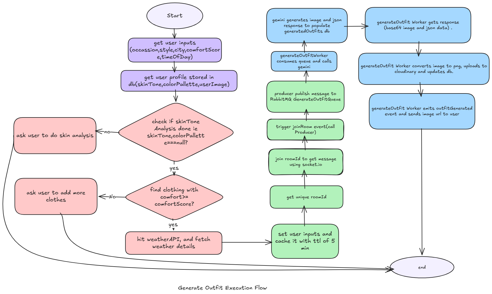
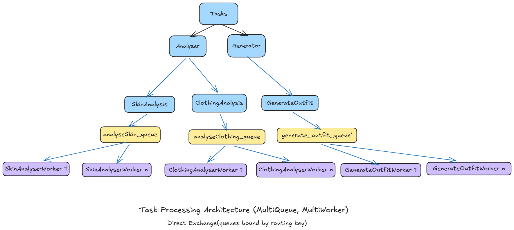

# WeathWear (Weather Based AI Stylist)

## The Problem

So I woke up one morning, getting ready to go to my office. My closet was full (no space literally)
Yet I always said I have nothing to wear.

The weather was hot (12 pm in summer), half my clothes didn't even go together.
Some felt comfy but didn't look good, some looked good but not suitable with the weather.

And I knew I wouldn't put more than 5 minutes into thinking what I am gonna wear today, or else I would be late to office.

And at the end, I ended up wearing the same outfit again.

## The Solution

This is when I thought, what if my wardrobe could decide it for me.

**(Why it would help?)**

1. I always forget what clothes I have
2. Too many clothes stacked on each other, and you never see them making out of your closet
3. Wearing same outfit often makes you get bored and wears your clothes early.
4. Depending on your (skin tone), the weather, occasion and comfort, you could rock the day wearing what suits you.
5. Organizes and saves time that goes into thinking about what I actually own

---

## Features of WeathWear:

1. **AI Based Closet Management:**
   User adds clothes, AI analyses and saves detailed description in DB

2. **Personalized Skin Tone Analysis:**
   User uploads photo, AI analyses:
   - Color palette of user
   - Skin tone
   - Saves suiting colors
   - Colors to avoid
   - Best neutral base colors
   - Base complexion, undertone, overtone, hair color, eye color and how it relates to skin tone

3. **Weather Analysis Based on City:**
   User provides city in generateOutfit API, weather API returns weather forecast for 3 days

4. **Weather Based Outfit Generation:**
   AI generates images of user wearing best suiting outfit based on weather, occasion, time of day (evening, night, afternoon), comfort level

5. **Mark Generated Outfits as Favorites:**
   User can mark outfits as favorites so they can revisit later

6. **See Previously Generated Outfits:**
   View outfit history

7. **Cloud Storage Integration:**
   Integrated cloudinary for storing user closet and generated outfits

8. **Distributed Processing:**
   Integrated RabbitMQ and Multi Queue-Multi Worker architecture for distributed processing, Worker Manager to scale up workers.

9. **Real-time Updates:**
   Integrated Socket.io for sending generated response to user

10. **Smart Caching:**
    Implemented caching (5 min TTL) using node-cache module to store user inputs and prevent data loss in server crashes

---
## Architecture




## So what you need to do? (as a user)

### 1) Upload clothes images

- **Step 1)** Take individual pictures of your clothes in good lighting (tops separate, bottom separate, dresses separate etc)
- **Step 2)** Label your clothes based on comfort level (1-5)
- **Step 3)** Label your clothes with clothing name, clothing type (top, bottom, dress etc), material type (woolen, cotton, silk etc)

### 2) Skin tone analysis (done once)

**Skin tone analysis:**

User uploads their photo in good lighting with visible hair, face, neck.
Gemini AI will analyze skin tone and categorize user as Spring, Summer, Autumn, Winter type and save in DB.

- **Spring:** Light skin, warm/golden undertone, golden shades
- **Autumn:** Medium to dark skin, golden/olive undertone
- **Winter:** Dark skin with cool undertone
- **Summer:** Light skin, pinkish undertone

### 3) Generate outfit  (user emits joinRoom event and listens to outfitGenerated event)

**Inputs:**

- User skin tone (fetched from DB)
- User color palette (fetched from DB)
- List of available clothing items (fetched from DB)
- Occasion: office/party etc (user input)
- Style: casual/formal/sports/party etc amongst predefined values of array (user input)
- Time of day: morning/evening/night etc (user input)
- Weather data (fetch from weather API)
- Preferred comfort (user input)

**Example:**

```json
{
  "occasion": "A movie night out at a theatre with girl-friends",
  "style": "date night",
  "city": "Bangalore",
  "comfortScore": 2,
  "timeOfDay": "evening"
}
```


---

## DB Schema:

### User

```javascript
{
  _id: ObjectId,
  name: String,
  email: String,
  password: String,
  skintone: String, // gemini saves it after analysis, eg: wheatish warm etc
  colorPalette: String, // gemini saves it after analysis (enum: spring, summer, autumn, winter)
  userImage: String // base64 encoded image
}
```

### Closet

```javascript
{
  _id: ObjectId,
  userId: ObjectId, // references user collection _id (which user's closet)
  clothingName: String, // user can name item so they remember it later eg. white shirt
  clothingType: String, // top, bottom, dress, sweater, jacket etc
  clothingMaterial: String, // cotton, leather, denim, silk, woolen etc
  ClothingDescription: String, // gemini sets it
  comfort: Number, // rate (1-5)
  imageURI: String, // uploaded to cloudinary
  cloudinaryPublicId: String // used to delete items later from cloudinary
}
```

### Outfits (stores generated outfits)

```javascript
{
  _id: ObjectId,
  userId: ObjectId, // references user collection _id
  clothingId: [ObjectId], // array references closet collection _id - generated image will have multiple clothing items so store their id's in db
  occasion: String,
  style: String,
  weather: Object,
  comfortScore: Number,
  reasoning: String, // why AI chose this outfit
  isFavourite: Boolean, // user can mark as favourite if user likes
  generatedImgUrl: String, // cloudinary url
  cloudinaryPublicId: String
}
```

---

## API's:

### authRoutes

```
POST /signup
POST /login
POST /refresh-token
```

### userRoutes

```
POST /addClothes           - upload clothes to gemini, gemini analyses it and generates descriptive details about it and stores in db
POST /analyseSkinTone      - Analyse skin tone
GET  /getCloset            - get all clothes
DELETE /deleteClothes/:id  - delete clothes
POST /generateOutfits      - generate outfits
PATCH /setFavourite/:id    - set an outfit as favourite
GET  /getFavourites        - get favourites
GET  /getGeneratedOutfits  - Get all generated outfits
PATCH /removeFavourite/:id - remove an outfit from favourite
GET  /getProfile           - get user profile
```

### weatherRoute

```
GET /weather/:city - hit weather API data (get weather location from user like city in generate outfits request)
```

---

## Thought Process:

### 1) AddClothes API

**Flow:**

1. User uploads clothing image using multer in jpg/jpeg/png format
2. Validate image extension
3. Validate if clothing name already exists in DB and throw error
4. User gives input with:
   - `clothingName` - so user can identify their owned outfits
   - `clothingType` - categorize as top, bottom, dress etc
   - `clothingMaterial` - fabric of cloth, used for generating weather based outfit suggestion using gemini
   - `comfort` - user marks comfort level between 1 to 5
5. Upload files to gemini
6. Upload clothing image to cloudinary for persistent storage
7. Create new document of clothing details
8. Call Producer to publish image to queue
9. imageAnalyserWorker listens to queue and calls gemini
10. Gemini returns detailed text description of clothing
11. Worker extracts JSON data and updates DB with clothing description

### 2) Skin Analysis API

**Flow:**

1. User uploads their image using multer in jpg/jpeg/png format
2. Check if skin analysis already done or not (i.e. value not equal to null)
3. Upload files to gemini
4. Convert image file to base64 to store in DB, later used for outfit generation
5. Call producer and send message to queue

**Things I kept in mind for this API:**

- Prevent double analysis, as user skin tone and features remain the same.

### 3) Generate Outfit API

**Input example:**

```json
{
  "occasion": "A movie night out at a theatre with girl-friends",
  "style": "date night",
  "city": "Bangalore",
  "comfortScore": 2,
  "timeOfDay": "evening"
}
```

**Flow:**

1. Take user input
2. On city, hit weather API using axios and get forecast weather for 3 days
3. Get user profile stored in DB (fetch skin tone, color palette, user image)
4. Filter closet for items >= comfortScore
5. Save all this in cache using node-cache module with key as roomID
6. Generate unique room ID and return as response
7. User joins the room with roomID i.e. emits joinRoom event
8. Socket.io listens to this event and calls Producer with cached data
9. Cached data lives for 5 min and survives server restart
10. Producer publishes message to queue
11. GenerateOutfitWorker listens to queue and calls Gemini API
12. Created image is in base64 format, store it to disk as PNG and then upload to cloudinary to store permanently

**Things kept in mind for this API:**

- If user skin analysis not done, throw error and ask user to hit skinAnalysis API first
- If closet empty, throw error and ask user to add more clothing to closet

---

## Challenges I Faced:

### 1) MongoDB Document Size Limitation

As a weather based AI styler app, it was important to store closet items.
MongoDB has document size of 16 MB and storing multiple images would have exceeded it.

- One option was storing image as base64 but that increases the original size of image as well

**So to fix it:**

I stored clothing images to cloudinary and saved their URL and public ID to DB.

### 2) Storing User Image to Cloudinary and Gemini Input Format for Image

Instead of uploading user image to cloudinary, I chose saving it as base64 image, as per user only one image is stored so document lies within 16 MB limit.

And gemini takes image either as inline base64 data or files API upload.
Since generateOutfit would require image to be passed later to gemini, Files API link would expire.
So stored as base64 and passed as inline data.

### 3) Another Challenge was Caching Data

I used npm node-cache module for caching the inputs and data required to call gemini for generateOutfit API.
Instead of storing it as an object in memory, so server restart would save it with TTL of 5 minutes.

And if data already processed by gemini, then delete cache data automatically, so frees memory as well.

```javascript
myCache.del(roomId);
```

- Prevents refetching weather data as well

### 4) Worker Manager

Instead of manually starting workers, worker manager scales up worker if too many messages in a particular queue.

Researched about scaling down workers, I understood that workers can be cancelled using it's unique ConsumerTag, but coudn't figure out where to access this attribute from. 

```javascript
// assume 1 worker can handle 2 tasks without very long wait times
if ((messageCount > defaultWorkers[queueName] * 2) && (defaultWorkers[queueName] < maxWorkers)) {
  // keep worker count under a threshold value
}


```

### 5) If User Deleted a Clothing from DB, the Cloudinary Uploads of the Clothing Item as well as All Generated Outfits Linked to that Clothing Should Also be Deleted

So deleting uploaded image using publicId:

```javascript
await cloudinary.uploader.destroy(outfit.cloudinaryPublicId);
```

---

## Setup to Run the Project:

### Required Stack:

- Node.js
- MongoDB
- RabbitMQ
- Cloudinary account
- Weather API key from (https://www.weatherapi.com)

### Steps to Run

1. npm install (install dependencies)
2. Configure .env file (.env.example is provided in repo)
3. rabbitmq-server start (start rabbitmq)
4. npm start
